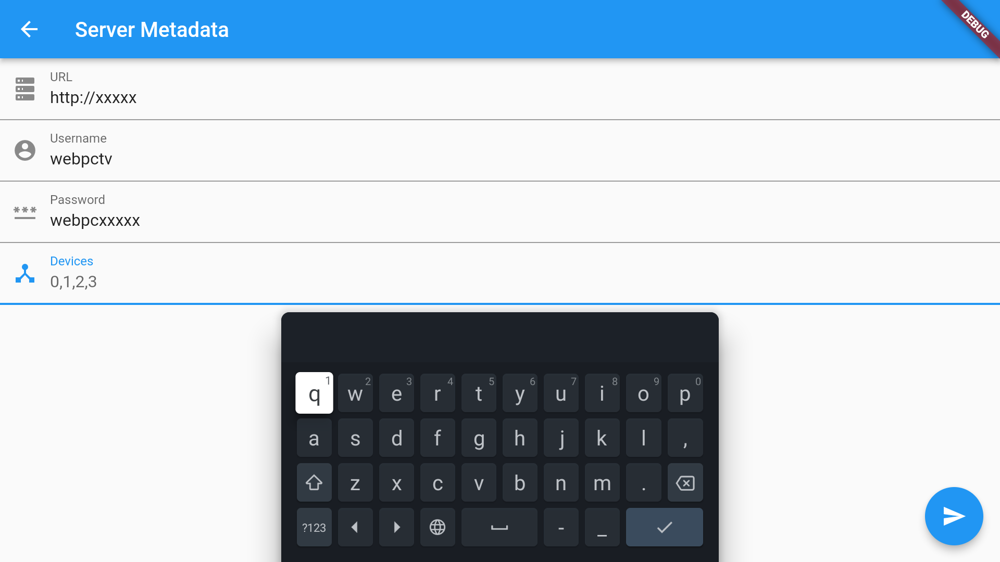
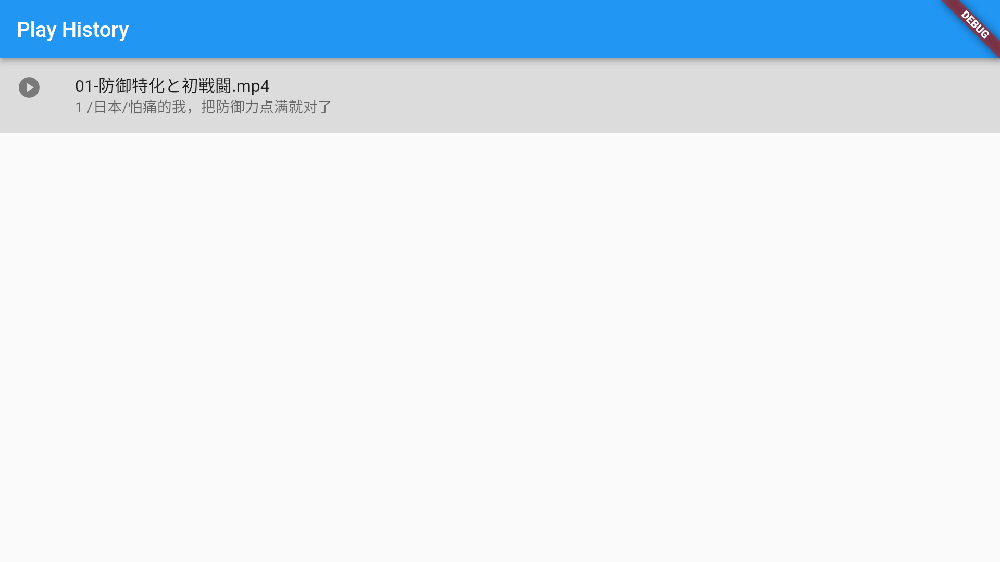
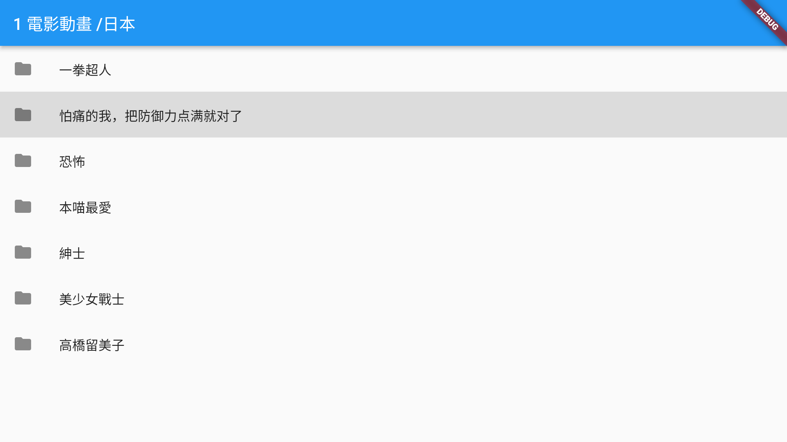
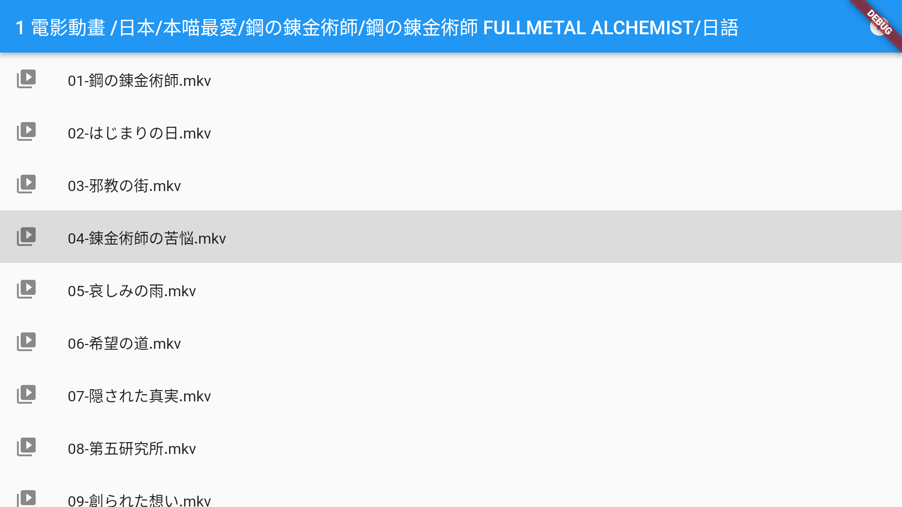
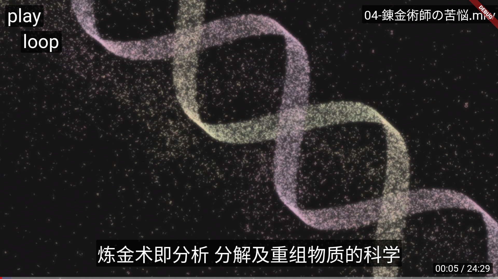

# webpctv
android tv for webpc

[中文](README.zh-Hant.md)

# what is webpctv

[webpc](https://github.com/powerpuffpenguin/webpc) is an open source remote program that I developed. One of the functions included is to play the video on the controlled end online.

So I thought that it would be a good idea to use webpc as an online video source, and then use the remote control to play the high-definition video provided by webpc on the TV in the living room, so I developed webpctv, which has only one function. Play the video provided by the webpc on the smart TV and record the playback history so that you can continue to watch the unfinished video next time.

# Android TV and Apple TV

This program is developed using flutter, so in theory both Android TV and Apple TV can run normally. But I don't have an Apple device, so I can't provide a pre-compiled package for Apple TV. The software to be used by Apple TV needs to be compiled by referring to the flutter tutorial.

For Android TV users, just download the latest apk installation package and install it on the smart TV to use it.

# How to use

The first time you run the app, you should see the following interface, you need to fill in the information of the webpc server you deployed

1. URL -> webpc server address
2. Username -> Username used to access the server
3. Password -> Password used to access the server
4. Devices -> webpc can control multiple controlled devices, each device will be bound with an id, fill in the device id you want to access here, the server itself is bound to id 0

If everything is normal, you will see the following interface, the structure of which is the folder structure of the controlled device. Use the remote control to select the video to be played.

# Control video playback

In addition to the basic fast-forward, rewind, and pause when the video is playing, you can also use the remote control to open the control menu to control the playback.

Using the Up or Down button on the remote opens the control menu, and using Back closes the control menu. After opening the control menu, you can use Up and Down to select the function to be controlled, and Left and Rigth to select the value under the function item.

# Control Menu

The control menu provides several functions, use Up and Down to switch the function to be used, and Left and Right to use the function.

* none -> No extra functions, remote buttons and closing menu provide the same function
* playlist -> webpctv will create a playlist for all the videos in the folder sorted by name, this menu function is used to select the video to play from the playlist
* caption -> External subtitles with the same name prefix as the video can be used by the program, here you can set the subtitles to be used or close the subtitles
* play -> Set play mode

|play mode|describe|
|---|---|
|list|When one video finishes playing, automatically play the next video|
|loop|When a video ends, replay the video|
|single|When a video finishes playing, stop playing|