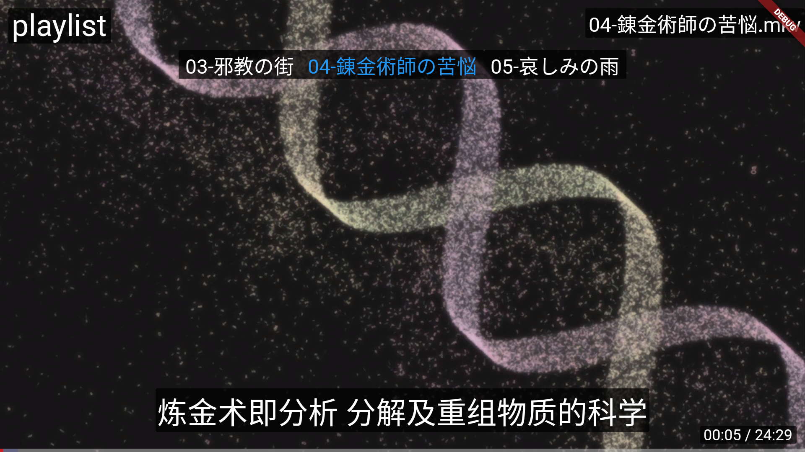

# webpctv
android tv for webpc

[English](README.md)

# webpctv 是什麼

[webpc](https://github.com/powerpuffpenguin/webpc) 是本喵開發了一個開源遠控程式，其中包含的一個功能是可以在線播放受控端上的視頻。

於是本喵想到可以將 webpc 作爲一個在線視頻源，然後在客廳的電視上使用遙控器來播放 webpc 提供的高清視頻將是一個再好不過的主意，於是本喵開發了 webpctv，它只有一個功能就是在智能電視上播放 webpc 提供的視頻以及記錄播放歷史以便可以將未看完視頻在下次繼續觀看。

# Android TV 和 Apple TV

本程式使用 flutter 開發所以 理論上 Android TV 和 Apple TV 都可以正常運行。但是本喵沒有蘋果的設備，所以無法提供 Apple TV 的預編譯包，Apple TV 要使用的化需要自己參考 flutter 教學編譯。

對於 Android TV 用戶只需要下載最新的 apk 安裝包到智能電視上安裝即可使用。

# 如何使用

第一次運行 app 你應該會看到下述界面，你需要填寫你部署的 webpc 服務器信息

1. URL -> webpc 服務器地址
2. Username -> 訪問服務器使用的用戶名
3. Password -> 訪問服務器使用的密碼
4. Devices -> webpc 可以控制多臺受控設備，每個設備會綁定一個 id，此處填寫你要訪問的設備 id，服務器本身被綁定到 id 0 上

如果一切正常，你會看到下述界面，其結構就是受控設備的檔案夾結構，使用遙控器選擇要播放的視頻播放即可

# 控制視頻播放

在視頻播放時除了基本的快進後退暫停播放外，你也可以使用遙控器打開控制菜單來控制播放。

使用遙控器上的 Up 或 Down 按鈕會打開控制菜單，使用 Back 可以關閉控制菜單。開控制菜單打開後你可以使用 Up 和 Down 來選擇要控制的功能使用 Left 和 Rigth 來選擇功能項下的值。

# 控制菜單

控制菜單提供了多個功能，使用 Up 和 Down 來切換要使用的功能，使用 Left 和 Right 來使用功能。

* none -> 沒有額外功能，遙控器按鈕和關閉菜單時提供相同的功能
* playlist -> webpctv 會爲檔案夾下的所有視頻按照名稱排序建立一個播放列表，此菜單功能用於從播放列表中選取要播放的視頻
* caption -> 與視頻擁有相同名稱前綴的外掛字幕可以被程式使用，此處可以設置要使用的字幕或關閉字幕
* fontsize -> 設置字幕的字體大小
* play -> 設置播放模式
* progress -> 以 1/10 爲步長，創建了幾個快速調整播放進度的按鈕

|播放模式|含義|
|---|---|
|list|當一個視頻播放結束後，自動播放下一個視頻|
|loop|當一個視頻播放結束後，重新播放此視頻|
|single|當一個視頻播放結束後，停止播放|